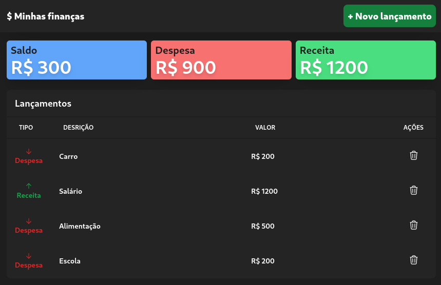

# MyFinance
Controle de finanças pessoais feito em React + TailwindCSS

<h1 align="center">
  
</h1>

## Tecnologias

Esse projeto foi desenvolvido com as seguintes tecnologias:

- [React](https://reactjs.org)
- [TypeScript](https://www.typescriptlang.org/)
- [TailwindCSS](https://tailwindcss.com/)

## Objetivo

Estudo de [React Hook](https://reactjs.org/docs/hooks-intro.html). Foram utilizados:

- useTransaction: CustomHook para gerenciamento das transações (despesas/receitas)
- useForm
- useState

## Github pages

Acesse diretamente pelo Github Pages em: [github.io/my-finance](https://rafatosta.github.io/my-finance/)

